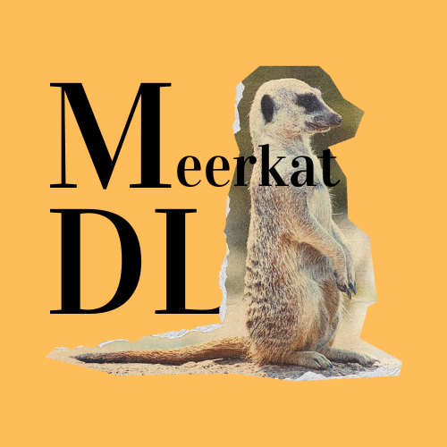

# Meerkat Deep Learning Framework



A Deep Learning Framework Just for Fun! 🥳

## Installation

```bash
$ pip install meerkat_dl
```

## Todo

- Automatic Differentiation [Done]
- Computation Graph [Done]
- Basic Layers (Dense [Done], RNN, CNN (2D and 3D), LSTM, Attention, Dropout, MaxPool, BatchNorm, LayerNorm, Initialization)
- Basic Activation Functions (ReLU, TanH, Sigmoid, Softmax) [Done]
- Basic Optimizers (SGD [Done], Minibatch SGD, Adam, Momentum, Adagrad, RMSProp, Adadelta, Learning Rate Scheduling)
- Basic Loss Functions (MSE [Done], CE, SoftMaxCE, Hinge, Margin, Triplet, KL, NLL, MAE)
- Write tests
- Gradient checker
- Correct dot, matrix multiplication, and element multiplication operators in Tensor [Done]
- Remove duplicate code in Operations forward pass
- Fix Min, Max, Mean, Flatten operations
- Add regularization
- Add reset graph for backward pass
- Add named parameters and named modules 

## Contributing

Interested in contributing? Check out the contributing guidelines. Please note that this project is released with a Code of Conduct. By contributing to this project, you agree to abide by its terms.

## License

`meerkat_dl` was created by Raghav Saboo. It is licensed under the terms of the MIT license.

## References

[Paszke, Adam, et al. "Automatic differentiation in PyTorch." (2017)](https://openreview.net/pdf?id=BJJsrmfCZ)

[Paszke, Adam, et al. "Pytorch: An imperative style, high-performance deep learning library." Advances in neural information processing systems 32 (2019).](https://proceedings.neurips.cc/paper_files/paper/2019/hash/bdbca288fee7f92f2bfa9f7012727740-Abstract.html)

[Atilim Guns Baydin, et al. "Automatic differentiation in machine learning: a survey" (2018).](https://arxiv.org/pdf/1502.05767.pdf)

## Credits

`meerkat_dl` was created with [`cookiecutter`](https://cookiecutter.readthedocs.io/en/latest/) and the `py-pkgs-cookiecutter` [template](https://github.com/py-pkgs/py-pkgs-cookiecutter).
